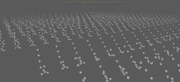

# maya-viewport-bbox
Makes your interaction in viewport fast, by changing viewport appearance to bounding box


        

## Installation

One you copy this script into your PYTHONPATH $HOME/maya/scripts/ directory you can invoke this script. Below code would install a event tracker for active view, and track mouse movement along with `Alt` button, upon releasing of `Alt` button it would restor previous appearance of the viewport.

```python
    >> tracker = BBBlastTracker('modelPanel1')
    >> tracker.install()
    >> tracker.uninstall()
    # OR from active camera view
    >> BBBlastTracker.install_from_active_panel()
```

## Get involved

Please open a issue if you face any issue or wanting to have any feature included
        
## Disclaimer

Please note, this is inital version and still has to go though some intense test, use at your won risk, Im not guaranteeing any data loss you may have after installation of this script. 
